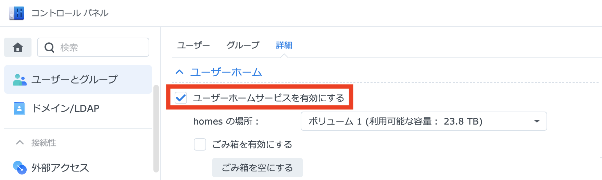
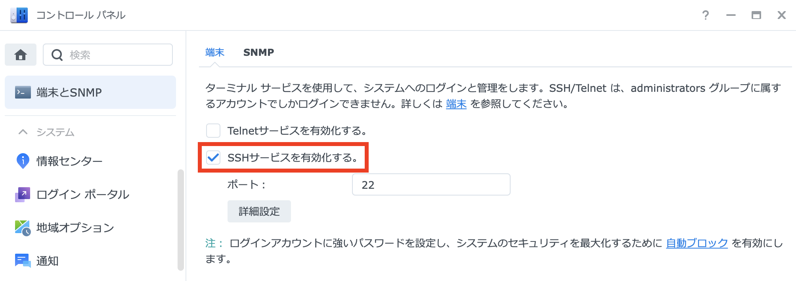
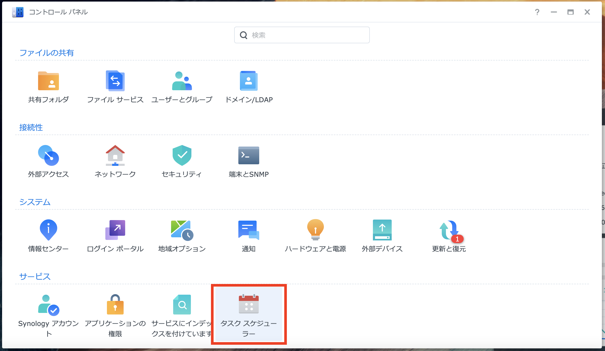
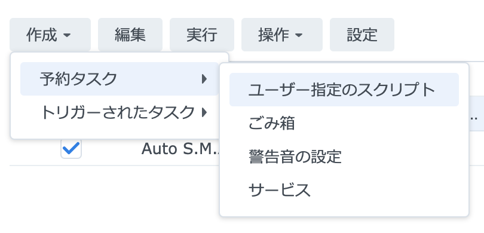
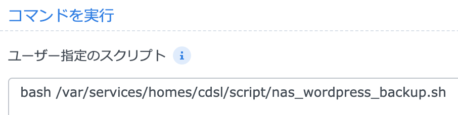

# このレポジトリについて
Synology製、タスクスケジューラー対応NASにWordPressのバックアップを行う為のレポジトリです。データの転送にはrsyncを使用します。

# 開発・動作環境
製品 : DS1621xs+   
DSMバージョン : DSM 7.0.1-42218 Update 3   

# 初期設定
1. DSMの設定画面からホームディレクトリとSSH接続を有効にします。   
* コントロールパネル → ユーザーとグループ → 詳細 → ユーサーホームサービスを有効にする
    
* コントロールパネル → 端末とSNMP → 端末 → SSHサービスを有効化する
    
2. DSMにSSH接続を行い、鍵の生成を行います。
```sh
ssh-keygen
```
3. WordPressが駆動しているサーバにDSMの秘密鍵を配置し、DSMからパスワード無しでSSH接続できるようにします。
4. WordPressが駆動しているMysqlサーバに接続し、dump可能な権限を付与したユーザを作成します。
```mysql
CREATE USER backup_user;
GRANT SELECT, LOCK TABLES, SHOW VIEW, RELOAD, REPLICATION CLIENT ON *.* TO 'backup_user'@'%' identified by 'pass';
```
5. NASにスクリプトを配置します。
6. SlackでWebhook URLを取得します。

7. 設定ファイルを変更します。
8. `nas_wordpress_backup.sh`を実行し、バックアップファイルが転送された事を確認します。
9. DSMのタスクスケジューラーでバックアップ処理を行う時間に`nas_wordpress_backup.sh`が実行されるように設定します。   

* コントロールパネル → タスクスケジューラー を開きます。  
    
* 作成 → 予約タスク → ユーザー指定のスクリプトから新規タスクを作成します。
   
* 実行ユーザ・実行時間とユーザ指定のスクリプトへ`bash <スクリプトのパス>`を入力します。
 

# スクリプトについて
* nas_wordpress_backup.sh  
WordPressサーバへリモートコマンドを実行し、バックアップファイルの作成とDSMへの転送を行います。
* config.sh   
バックアップスクリプトに必要な設定ファイルです。

# 設定ファイル
## config.sh   
|  変数名  |  内容  |  設定例  |
| ---- | ---- | ---- |
|  DsmSlackPostPath  |  Slack通知用スクリプト保存先  |  DsmSlackPostPath="./slack_post.sh" |
|  SlackWebHook  |  Slack通知用WebHookURL  |  SlackWebHook="https://hooks.slack.com/services/--" |
|  SlackPostName  |  Slack通知用機器名  |  SlackPostName="NAS"  |
|  DsmFileGenerations  |  バックアップファイル保存数  |  DsmFileGenerations="5" |
|  DsmFilePath  |  バックアップファイル保存先  |  DsmFilePath="/volume1/wordpress_backup/" |
|  RemoteHost  |  リモートサーバのアドレス  |  RemoteHost="192.168.201.51" |
|  RemoteUser  |  リモートサーバのユーザー  |  RemoteUser="web" |
|  DsmPrivateKey  |  リモートサーバ接続時使用鍵  |  DsmPrivateKey="/var/services/homes/cdsl/.ssh/id_rsa" |
|  RemoteWebRootDirectory  |  バックアップ対象ディレクトリ  |  RemoteWebRootDirectory="/var/www/html" |
|  RemoteMysqlUser  |  リモートサーバデータベースユーザ  |  RemoteMysqlUser="user"  |
|  RemoteMysqlPass  |  リモートサーバデータベースパスワード  |  RemoteMysqlPass="password" |
|  RemoteMysqlDbName  |  リモートサーバデータベース名  |  RemoteMysqlDbName="wp" |


