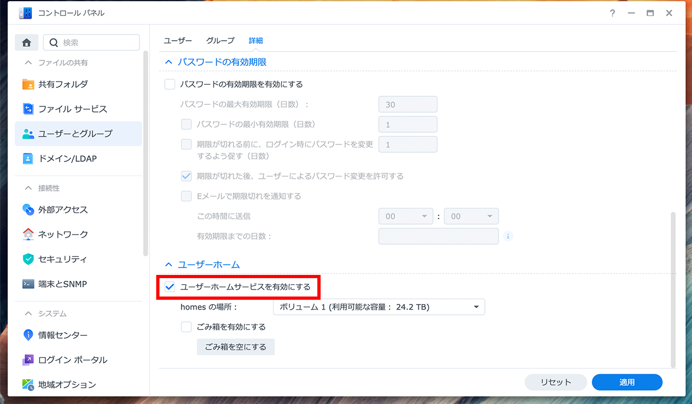

# このレポジトリについて
Synology製、タスクスケジューラー対応NASにWordPressのバックアップを行う為のレポジトリです。   
データの転送にはrsyncを使用します。

# 開発・動作環境
製品 : DS1621xs+   
DSMバージョン : DSM 7.0.1-42218 Update 3   

# 初期設定
1. DSMの設定画面からホームディレクトリとSSH接続を有効にします。   
* コントロールパネル　→　ユーザーとグループ　→　詳細　→　ユーサーホームサービスを有効にする
    
* コントロールパネル　→　端末とSNMP　→　端末　→　SSHサービスを有効化する
    
2. DSMにSSH接続を行い、鍵の生成を行います。
```sh
ssh-keygen
```
3. WordPressが駆動しているサーバにDSMの秘密鍵を配置し、DSMからパスワード無しでSSH接続できるようにします。
4. nasディレクトリ内のスクリプトをDSM内に配置します。
5. webディレクトリ内のスクリプトをWordPressサーバに配置します。
6. SlackでWebhook URLを取得します。

7. Slack通知用スクリプト`slack_post.sh`の変数`URL`に取得したWebhook URLを記述します。
8. DSM用スクリプト`nas_wordpress_backup.sh`とWordPress用スクリプト`create_backup_data.sh`のパラメータを変更します。
9. `create_backup_data.sh`を実行した後、`nas_wordpress_backup.sh`を実行し、NASにバックアップデータが転送される事を確認します。
10. DSMのタスクスケジューラーとWordPressサーバのcrontabを使用し、バックアップスケジュールを設定します。 `create_backup_data.sh`の約5分後に`nas_wordpress_backup.sh`が実行されるように設定してください。どちらも管理者権限で実行できるようにしてください。

# スクリプトについて
* slack_post.sh   
(DSM、WordPressサーバ共通)   
slackに通知する為のスクリプトです。  
コマンドライン変数で１つ目に名前、２つ目にメッセージを指定して実行します。
* create_backup_data.sh  
(WordPressサーバ用スクリプト)   
データベースの内容とWordPressのコンテンツを圧縮し、バックアップファイルを作成します。
* nas_wordpress_backup.sh  
(DSM用スクリプト)
WordPressサーバで作成されたバックアップファイルをNASへ転送します。設定した次元数以上のファイルが転送された場合がは古いファイルから削除します。

# パラメータ
## slack_post.sh   
|  変数名  |  内容  |  設定例  |
| ---- | ---- | ---- |
|  URL  |  TD  |  URL="https://hooks.slack.com/services/TKNKCFACS/****" |

## create_backup_data.sh   
|  変数名  |  内容  |  設定例  |
| ---- | ---- | ---- |
|  SlackPostPath  |  slack_post.shの配置場所  |  SlackPostPath="/usr/local/bin/slack_post.sh" |
|  SlackPostName  |  Slack通知用の名前  |  SlackPostName="JP-WEB サーバー" |
|  DataPath  |  バックアップデータ作成先  |  DataPath="/var/tmp/backup_data/" |

## nas_wordpress_backup.sh 
|  変数名  |  内容  |  設定例  |
| ---- | ---- | ---- |
|  Generations  |  残すバックアップデータ数  |  Generations="5" |
|  FilePath  |  バックアップデータディレクトリ(NAS)  |  FilePath="/volume1/wordpress_backup/" |
|  SlackPostPath  |  slack送信用スクリプトの場所  |  SlackPostPath="/var/services/homes/cdsl/script/slack_post.sh" |
|  SlackPostName  |  slack送信用の名前  |  SlackPostName="Natadecoco(NAS)" |
|  PrivateKey  |  リモートサーバで使用する秘密鍵  |  PrivateKey="/var/services/homes/cdsl/.ssh/id_rsa" |
|  Host  |  リモートサーバのアドレス  |  Host="192.168.201.51" |
|  User  |  リモートサーバのユーザー  |  User="web" |
|  DataPath  |  バックアップデータの取得先  |  DataPath="/var/tmp/backup_data/" |

# 変更予定
* 設定ファイルの独立化
* `create_backup_data.sh`の実行をNASから行い、DMSのタスクスケジューラーのみで実行できるように
* 相対パスによるパラメータの設定